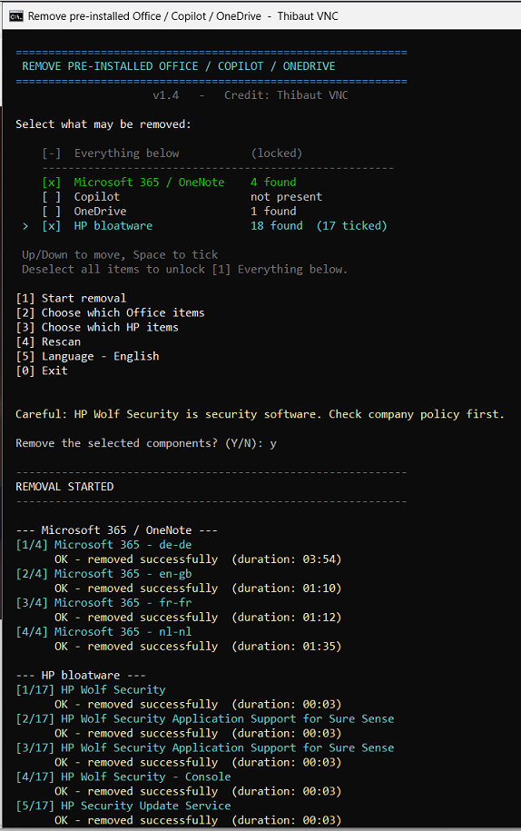

# Remove Pre-installed Office / Copilot / OneDrive / HP Bloatware

Those pre-installed Microsoft 365, Copilot, OneDrive and HP packages on every new laptop are pretty annoying, and the official SaRA tool won't take them off your hands anymore. Worry no more.

A menu-driven cleanup tool for freshly imaged or OEM Windows machines. Tick what may go, review what was found, confirm, done. Ships with a one-click launcher so you never have to touch the execution policy.



---

## Why

Every new machine shows up with a trial build of Microsoft 365 already baked in, Copilot pinned to the taskbar, OneDrive nagging the user to sign in, and — on HP hardware — a Wolf Security stack nobody asked for. Push your own Office deployment on top of that and you either get a failure or a lovely mixed install that nobody wants to troubleshoot at 4 PM on a Friday. Removing it all through **Settings > Apps** works, but it is slow and it needs somebody clicking through dialogs on every single box.

So: this tool digs the packages out of the registry and the Appx store and hands them to Microsoft's own uninstallers with the UI switched off. You tick what you want gone, it does the work, you get a clean machine.

---

## Components

Each component is a separate module. Pick one, pick two, or take the lot.

### Microsoft 365 / OneNote

Scans both the 64-bit and 32-bit uninstall registry hives for Click-to-Run products whose display name starts with `Microsoft 365 - ` or `Microsoft OneNote - `, then calls each package's own `UninstallString` with `displaylevel=False` so the removal runs silently.

**The match pattern is deliberately narrow, and you should think twice before widening it.** A licensed volume installation shows up as `Microsoft 365 Apps for enterprise - en-us`, which does *not* match `Microsoft 365 - ` because of the words in between. That is the whole point: run this on a machine that already has your paid deployment and it will correctly find nothing. Broaden the pattern to something like `Microsoft 365*` and it will happily uninstall the licensed product instead.

MSI-based Office installations use a different naming pattern and are left alone for the same reason.

#### Keeping one language

OEM images often carry several language SKUs of the same Click-to-Run install — `Microsoft 365 - nl-nl`, `- fr-fr`, `- en-us`. Each has its own uninstall string that targets that language only, so they can be removed individually.

When more than one Office item is detected, a `[P]` option appears in the menu. It opens a picker where every item is ticked by default; untick the one you want to keep and it is left alone. The main menu then shows how many are still ticked:

```
   [2]  [ ]  Microsoft 365 / OneNote      4 found  (3 ticked)
```

### Copilot

Removes Copilot in three passes:

1. Installed Appx packages for all users (`Remove-AppxPackage -AllUsers`).
2. Provisioned packages, so it does not come back for newly created profiles.
3. Sets `HKLM\SOFTWARE\Policies\Microsoft\Windows\WindowsCopilot\TurnOffWindowsCopilot = 1`, so a feature update does not quietly reinstate it.

Some Copilot components ship as protected system apps. Those cannot be uninstalled and are reported as *Protected by Windows – left in place*; the policy key still keeps them switched off.

### HP bloatware

Detects the usual OEM payload on HP machines: HP Wolf Security and its console, HP Support Assistant, HP Sure Click / Sure Sense / Sure Run, HP Client Security Manager, HP Connection Optimizer, HP JumpStart, HP Privacy Settings, HP QuickDrop, myHP, and the HP Store apps that all ship under the same publisher prefix.

Three things worth knowing about how it behaves:

**Wolf Security is removed in a fixed order.** It only uninstalls cleanly as base package first, then the Console, then the HP Security Update Service. The tool sorts the detected items into that order automatically, so you do not have to think about it.

**Components without a silent uninstall are skipped, not forced.** If a package offers no `QuietUninstallString` and is not an MSI that can be driven with `/qn`, the tool reports it as *no silent uninstall – remove manually* and moves on. Running it anyway would pop a GUI and hang the whole run waiting for a click.

**Drivers and hardware components are deliberately absent from the list.** HP Hotkey Support, audio components and firmware utilities are not matched, because removing them breaks your function keys and sound. As with the Office pattern, the match list is curated rather than a broad `HP*` sweep.

**Success is verified, not assumed.** Several HP uninstallers return exit code 0 within a few seconds while the actual work happens elsewhere — or while Wolf Security's tamper protection quietly blocks them. Trusting that exit code produces a summary full of green *removed successfully* lines next to a Programs list that has not changed. So after each uninstall the tool polls the registry until the entry is really gone, and reports *reported OK but still installed* when it is not.

#### Wolf Security is stubborn

Expect to run this twice. Wolf Security protects itself while its services are running, so the first pass often gets partway and the rest needs a reboot. `HP One Agent` is in the list for the same reason: it is the component that re-deploys HP software, so it is removed last, after the things it would otherwise reinstall.

If components survive, the tool says so explicitly and offers to reboot straight away, so you can go into the second pass without leaving the menu.

**The desktop will disappear mid-run, and that is expected.** HP's uninstallers unload shell extensions, which takes `explorer.exe` down with them — desktop, taskbar and File Explorer all vanish at once. Windows is fine underneath; only the shell is gone. The tool warns you before the HP step starts, and restarts Explorer once the module finishes.

Every run ends with a reboot prompt, because HP's uninstallers leave services and the shell in a half-restarted state. Answering no just returns you to the menu.

One caveat that is a policy question rather than a technical one: HP Wolf Security is security software. On a company machine, removing it may be something your organisation actually relies on. The tool warns you before it runs, but it cannot know your policy.

### OneDrive

Stops any running `OneDrive.exe`, then runs `OneDriveSetup.exe /uninstall` from every location where it exists — `SysWOW64`, `System32` and the per-user install under `%LOCALAPPDATA%`.

**This module never touches user data.** The `%USERPROFILE%\OneDrive` folder and everything in it is left exactly where it is. The tool still warns you before it runs, because on a machine that is already in production OneDrive may be actively syncing company files.

---

## Selection menu

```
   >  [x]  Everything below
      ------------------------------------------------------
      [-]  Microsoft 365 / OneNote   (locked)
      [-]  Copilot                   (locked)
      [-]  OneDrive                  (locked)
      [-]  HP bloatware              (locked)

   Up/Down to move, Space to tick
```

Move with the **arrow keys**, tick with **Space**. The digits are reserved for the actions underneath, so nothing overlaps.

The selection is mutually exclusive by design:

- Tick **[1] Everything below** and the three individual entries lock (shown as `[-]`).
- Tick any individual entry and **[1]** locks instead.
- Deselect to unlock the other side. No ambiguous state where "All" and a subset are both active.

Each entry shows what the scan actually found, so you know before you start whether there is anything to do.

| Key | Action |
|---|---|
| ↑ / ↓ | Move between components |
| Space | Tick or untick the highlighted component |
| `1` or Enter | Start removal (asks for confirmation) |
| `2` | Pick individual Office items (appears when more than one is found) |
| `3` | Pick individual HP items (appears when more than one is found) |
| `4` | Rescan |
| `5` | Language — English / Nederlands / Français |
| `6` | Reboot now (asks for confirmation) |
| `0` | Exit |

The Office and HP pickers work the same way: arrows and Space, with `A` to tick everything and `N` to clear it.

On hosts that cannot read single keypresses — PowerShell ISE, some remoting setups — the tool falls back to typed input automatically and shows letter shortcuts (`A`, `O`, `C`, `D`, `H`) instead.

---

## Features

- **One-click launcher** — the batch file elevates itself and runs the script with an execution policy bypass, so it works on a locked-down machine without any setup.
- **Multilingual** — English (default), Dutch and French, switchable at runtime.
- **Live progress** — per-package counter, spinner and elapsed timer, because a full Office removal can take minutes and would otherwise look frozen.
- **Readable exit codes** — `0`, `1641` and `3010` reported as success, with `1641`/`3010` flagged as *restart required*, instead of a bare number.
- **Summary report** — every component and its final status once the run finishes.
- **Safe by default** — read-only scan until you explicitly confirm.

---

## Requirements

| | |
|---|---|
| OS | Windows 10 / 11 |
| PowerShell | 5.1 or later (7.x also works) |
| Rights | Administrator — enforced in both releases |

---

## Usage

### Easiest way

Right-click `uninstall_preinstalled_office.bat` and choose **Run as administrator**. It unblocks the script, bypasses the execution policy for that run only, and starts the menu. Keep the `.bat` and the `.ps1` in the same folder.

### From CMD

A quoted path runs directly in CMD, so this is enough:

```
"%USERPROFILE%\Downloads\uninstall_preinstalled_office.bat"
```

Or change directory first:

```
cd /d "%USERPROFILE%\Downloads"
uninstall_preinstalled_office.bat
```

The launcher starts PowerShell inside the same console window, so the menu appears right where you are. If your CMD is not already elevated, it asks for administrator rights and the menu opens in a new elevated window instead — elevation cannot happen inside a running process.

### From PowerShell

Same launcher, but PowerShell needs the call operator in front of the path:

```powershell
& "$env:USERPROFILE\Downloads\uninstall_preinstalled_office.bat"
```

### Manually

Open PowerShell **as Administrator**, then `cd` into the folder holding the script:

```powershell
cd "$env:USERPROFILE\Downloads"
Unblock-File .\uninstall_preinstalled_office.ps1
& .\uninstall_preinstalled_office.ps1
```

Or run it from anywhere with a full path — note the `&` in front:

```powershell
Unblock-File "$env:USERPROFILE\Downloads\uninstall_preinstalled_office.ps1"
& "$env:USERPROFILE\Downloads\uninstall_preinstalled_office.ps1"
```

If the execution policy still blocks it, run it for that session only:

```powershell
powershell.exe -ExecutionPolicy Bypass -File .\uninstall_preinstalled_office.ps1
```

### If PowerShell won't run it

**`The file ... is not digitally signed`** — the script came from the internet and carries a mark-of-the-web. Run `Unblock-File` on it as shown above, or use the `.bat` launcher which does it for you.

**`The term '...' is not recognized`** — a quoted path on its own is just a string to PowerShell, so it gets printed back instead of executed. Put the call operator `&` in front of it. And `.\` means "in the current folder", so it cannot be combined with a full path like `.\C:\Users\...`.

**`Get-Process : A positional parameter cannot be found`** — the `PS C:\...>` prompt got pasted along with the command. `PS` is the alias for `Get-Process`, so PowerShell tries to run that instead. Copy only the command itself, never the prompt in front of it.

**A window that looks frozen** — check the title bar. If it starts with *Select* or *Selecteren*, a stray mouse click put the console into selection mode, which pauses all output until you press Esc.

---

## Exit codes

The Click-to-Run and OneDrive uninstallers return standard Windows Installer codes:

| Code | Meaning |
|---|---|
| `0` | Removed successfully |
| `1641` | Success, restart required |
| `3010` | Success, restart required |
| `1602` | Cancelled by the user |
| `17002` | Scenario interrupted — another Office operation was already running |

Anything else is printed with its raw code so you can look it up.

---

## What's in the repo

| File | Purpose |
|---|---|
| `uninstall_preinstalled_office.ps1` | The tool itself |
| `uninstall_preinstalled_office.bat` | Launcher — self-elevates and runs the script, no execution policy to fight |
| `image.png` | Screenshot used in this README |

---

## Changelog

### v1.7

- Every run now ends with a **reboot prompt**, not just the runs that report a pending restart.
- A heads-up before the HP step explains that the desktop and taskbar are about to vanish.

### v1.6

- Added a **reboot option** (`6`), plus an offer to restart right after a run that needs one.
- **Explorer is restarted automatically** after the HP module, since HP's uninstallers take the shell down with them.

### v1.5

- HP removals are now **verified against the registry** instead of trusting the uninstaller's exit code, which several HP components return as success within seconds while changing nothing.
- Added `HP One Agent`, `HP Insights` and `HP Analytics`; One Agent is removed last because it re-deploys the rest.
- Surviving components are reported as such, with a reboot-and-retry prompt.

### v1.4

- Added an **HP bloatware** module: Wolf Security and console, Support Assistant, Sure Click / Sure Sense / Sure Run, Client Security Manager, Connection Optimizer, JumpStart, Privacy Settings, QuickDrop, myHP and the HP Store apps.
- Wolf Security components are removed in the order they actually uninstall in.
- Packages with no silent uninstall are reported rather than launched, so a GUI never hangs the run.
- Drivers, HP Hotkey Support and audio components are excluded by design.
- The item picker is now generic and serves both the Office and HP lists.

### v1.3

- **Arrow-key navigation** with Space to tick, instead of typing numbers to toggle.
- Digits now drive the actions (`1` start, `2` Office picker, `3` rescan, `4` language, `0` exit); Enter also starts.
- Automatic fallback to typed input on hosts without single-key support.

### v1.2

- Added a **per-item picker** for Office: when several language SKUs are detected you can untick the ones to keep instead of taking all or nothing.
- Faster startup — Copilot detection now filters inside the Appx API instead of pulling every package through the pipeline.
- The scan shows live progress per component instead of an empty screen.

### v1.1

- Added **Copilot** removal: Appx packages for all users, provisioned packages, plus the `TurnOffWindowsCopilot` policy so it stays gone after feature updates.
- Added **OneDrive** removal: process stop and `OneDriveSetup.exe /uninstall` from all three install locations. User data is never touched.
- New **selection menu** with mutually exclusive "Everything below" and per-component ticks, showing what the scan found for each.
- Added a **launcher** (`uninstall_preinstalled_office.bat`) that self-elevates and runs the script without execution policy hassle.
- Warning shown before removing OneDrive on a machine that may be syncing company files.

### v1.0

- Menu-driven removal of Microsoft 365 / OneNote Click-to-Run packages.
- Live progress with elapsed timer, translated exit codes, summary table.
- English / Dutch / French interface, switchable at runtime.

---

## Notes

- Hit a `17002`? Something Office-related was already running. Let it finish, rescan, try again.
- After a `1641` or `3010`, reboot before installing your own Office deployment. It saves you a support ticket later.
- If a console window ever looks frozen, check the title bar. A stray mouse click puts CMD and PowerShell consoles into selection mode, which pauses all output until you press Esc.

---

## Credit

**Thibaut VNC**
